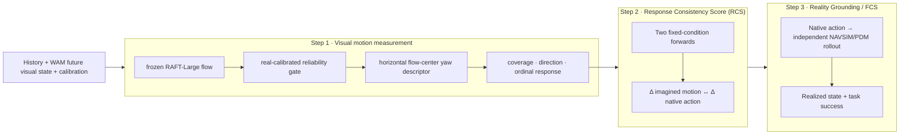

# IAC Benchmark: Imagined-future and Action Consistency

**Frozen benchmark:** **1,000 non-overlapping NAVSIM windows**

**Repository:** [RiseBun/IAC](https://github.com/RiseBun/IAC)

**中文文档:** [README_zh.md](README_zh.md)

**Joint evaluation framework:**
[`docs/WAM_JOINT_EVALUATION_FRAMEWORK_ZH.md`](docs/WAM_JOINT_EVALUATION_FRAMEWORK_ZH.md)

The machine-readable stages, input prohibitions and promotion gates are in
[`configs/wam_joint_evaluation_v1.json`](configs/wam_joint_evaluation_v1.json).

IAC is an evaluation protocol for world action models (WAMs). It asks a
specific question: when a model emits a native action, is that action aligned
with the future visual state the model predicts? IAC separates measurement,
intervention consistency, and execution instead of collapsing them into a
single video-quality or task-success number.

This repository is the reproducible release package. It contains no raw
NAVSIM/Waymo frames, private ground truth, WAM checkpoints, or generated video.
Those inputs are attached by the evaluation server through the manifest
interface. Waymo is an external-domain protocol, not part of the leaderboard.

> **Protocol & code are reproducible; the published leaderboard numbers are
> reproduced on a private evaluation server with licensed data.** Per-sample
> DriveWAM outputs, private images, ground truth, and PDM caches are not
> redistributed, so the reference table cannot be independently recomputed
> from this repository alone.

## Contributions

1. **Candidate-blind motion measurement.** The selected S1.3 path reads a frozen
   RAFT-Large flow field directly as an ordinal yaw response, without metric
   reconstruction or candidate trajectories. The continuous ground-plane SE(2)
   decoder remains an explicit, fail-closed diagnostic. Only yaw direction/rank
   enters the primary score.
2. **Capability-stratified metrics.** The canonical metrics are Motion Alignment
   Score (MAS; legacy CFAC), Response Consistency Score (RCS; legacy CCFC), and
   Grounding Score (GS; legacy FAU components), with FCS reported separately.
   Each is an evidence column with its own coverage. Unsupported capabilities
   are `unavailable`, not zero-filled.
3. **Fail-closed reproducibility.** Exact timestamps, calibration, model
   revision, seed and lineage are required. Private GT is joined only on the
   evaluation server; submitted motion profiles cannot replace image probing.
4. **Structural counterfactual channel (experimental).** Same-source
   left/right flow differences are exposed as an ordinal, decoder-free signal
   for the Response Consistency Score (RCS; legacy structural CCFC-S). This is
   separate from metric MAS/GS and is not promoted to a frozen score until
   independent validation is complete.

The release does **not** claim a new optical-flow architecture. The novelty is
the leakage-resistant measurement and scoring protocol built around a frozen,
audited flow component.

## Three-step protocol



### Step 1: visual motion measurement

The selected S1.3 path bypasses metric SE(2) reconstruction: it aggregates the
reliable horizontal-flow center over common intervals and tests whether its
left/right change follows the native-action yaw change. Its frozen entry point
is [`configs/flow_structure_yaw_v1_3.json`](configs/flow_structure_yaw_v1_3.json).
The continuous Step 1.2 contract below is retained as a metric-reconstruction
diagnostic, not cascaded or fused into S1.3. The candidate-blind coarse
initializer G is an experimental ablation of that diagnostic path.

The restored Step 1.2 contract uses evaluator images at `448×256`, explicitly
declares that calibration comes from `1920×1080`, runs RAFT at `512×288`, and
maps flow and intrinsics into evaluator coordinates. Its frozen configuration is
[`configs/plane.json`](configs/plane.json):

```text
future RGB (or a fixed, checksummed latent decoder)
  → RAFT-Large forward/backward flow
  → consistency mask + spatially stratified road sampling
  → candidate-blind continuous SE(2) fit
  → output projection support + improvement over zero flow
  → explained / weak / abstain
  → primary yaw direction and paired ordinal response
```

`measurement_available` requires output projection support at all four future
intervals. `explained` additionally requires at least `0.05` energy improvement
over the zero-flow baseline. A branch is scored only when it is `explained`; a
CCFC pair requires both branches to be `explained`. Lateral, curvature, distance,
and speed remain diagnostics because their held-out amplitude audits failed.

The real-frame calibration audit resolves logged GT from each sample's source
pickle and verifies that `future_trajectory` matches the recorded realized ego
state. On material endpoints, median readout ratios are `0.916` for yaw, `0.480`
for lateral displacement, and `0.565` for longitudinal displacement. Yaw has
`116/117 = 99.1%` direction accuracy and `0.918` Spearman, including 91
lateral-turn samples. Generated branches never label the WAM action head as GT;
the protocol rejects that identity and accepts a GT pointer only with an
explicit trusted realized-trajectory source.

DriveWAM input pickles now fail closed on the model's native temporal contract:
`[current, future_0.5s, ..., future_4.0s]`. Earlier generated results used a
misaligned `4 history + 8 future` array and are withdrawn. On the regenerated
255-pair set, single-branch all-interval projection coverage is
`459/510 = 90.0%` and explained coverage is `380/510 = 74.5%`. Pair coverage
is `218/255 = 85.5%` for projection and `171/255 = 67.1%` for both branches
explained. Among 106 pairs with at least `0.01 rad` native-action yaw separation,
direction accuracy is `87/106 = 82.1% [73.7%, 88.2%]`; Spearman is
`0.832 [0.731, 0.902]`.

A candidate-blind coarse initializer is retained as the Step 1.3-G ablation. It
raises explained pair coverage to `205/255 = 80.4%` and Spearman to `0.925`
without degrading the shared-pair direction result; on real logged frames it
also raises explained coverage from `217/255` to `231/255` and yaw Spearman
from `0.918` to `0.992`. It remains experimental because strict pair coverage
is below 90%. The reconstruction-free S1.3 yaw pilot reaches `254/255 = 99.6%`
pair coverage, `126/149 = 84.6% [77.9%, 89.5%]` direction accuracy and `0.779`
Spearman. S1.3 is therefore the sole selected Step 1 execution path; Step 1.2
and 1.3-G are retained only as metric diagnostics and are not cascaded or fused
into its score. The frozen entry point is
`configs/flow_structure_yaw_v1_3.json`.

S1.3 was then tested on the same 174 sources and exact action interventions in
DriveWAM and Epona. Pair coverage was `100%` versus `97.7%`, direction accuracy
was `85.7%` versus `92.4%`, and Spearman was `0.805` versus `0.739`; the natural
quality differences do not exclude zero. Because two naturally generated WAMs
need not differ, model separation is reported but is not treated as validity.
The original separation promotion gate remains failed; it is not retroactively
marked as passed.

A positive control was preregistered before execution: only the left/right
future-video contrast was reduced to `100% / 50% / 0%`, with actions, sources,
history, calibration and thresholds fixed. Coverage stayed above `97%` on both
WAMs, while median response strictly decreased to zero; at zero contrast,
Spearman became unavailable. S1.3 is therefore validated as a cross-WAM
**action-response measurement**, not as a natural WAM quality ranking or
logged-GT fidelity metric. The frozen protocol hash is unchanged; aggregate
validation is recorded in `configs/flow_structure_yaw_v1_3_validation.json`.
The off-the-shelf SEA-RAFT A/B is rejected.

An additional exploratory structural channel is defined in
[`configs/flow_structure_counterfactual_delta_v1.json`](configs/flow_structure_counterfactual_delta_v1.json).

The current structural forward-consistency candidate is specified in
[`configs/ccfc_structure_forward_v1.json`](configs/ccfc_structure_forward_v1.json).
It compares the left/right video flow difference with the flow induced by the
corresponding action trajectories, and reports direction, response gain,
temporal persistence, and normal/reversed/zero controls. It deliberately does
not reconstruct metres or treat unavailable projection support as zero.
For the same `source_key`, it computes

```text
ΔS_F = S_F(left) − S_F(right)
```

and reports raw/common-motion-normalized deltas, direction and temporal
persistence without reconstructing metres or radians. It can support the
structural `RCS`, but it does not replace metric `MAS` or `GS`; progress
descriptors remain diagnostic until the independent pure-speed swap validation
is complete.

### Step 2: Motion Alignment (MAS) and Response Consistency (RCS)

**Motion Alignment Score (MAS; legacy CFAC)** compares one run's imagined motion
profile `P_F` with its native action profile `P_A`. **Response Consistency Score
(RCS; legacy CCFC)** compares the changes produced by two reproducible
forwards with the same history, seed and nuisance variables:

```text
ΔS_F = S_F(branch 1) − S_F(branch 0)
ΔP_A = P_A(branch 1) − P_A(branch 0)
RCS = ordinal_consistency(ΔS_F, ΔP_A)
```

`RCS` is the structural form used by the current framework. It measures
whether imagined structure and native action respond consistently to the same
intervention; it is not by itself proof that the action was causally generated
from the predicted future. A future-to-action claim requires an additional
future-only intervention or pathway-ablation control (see the framework
document).

Any auditable intervention is allowed (for example left/right, slow/fast,
command change or latent swap). Semantic clear/risk is optional. The evaluator
must receive both regenerated future visual output and native action; injecting
an action after generation is only an action-response diagnostic, not CCFC.

The tentative Grounding Score (GS) reports whether imagined motion and native
action approach the private ground-truth future. Its compatibility components
remain `FAU_F` and `FAU_A`, with legacy `FAU = sqrt(FAU_F × FAU_A)`.

`MAS` in the structural domain requires an action-to-structure
mapping fitted on a separate calibration set and frozen before confirmation.
Until that calibration is validated, it must be reported as `unavailable`, not
as a metre-domain error. The executable pilot bundle is recorded in
[`reports/wam_three_metric_pilot_20260911.json`](reports/wam_three_metric_pilot_20260911.json).

The current cross-model pilot scorecard is recorded in
[`reports/ccfc_structure_forward_scorecard_20260911.json`](reports/ccfc_structure_forward_scorecard_20260911.json).
The same candidate separates a strong response (WorldDrive eval25 extension:
direction cosine `0.998`, temporal persistence `1.0`, response gain `1.469`)
from weak or absent responses (DriveVA: `0.129`/`0.061`; DriveWAM:
`0.016`/`0.0045`). These are pilot diagnostics, not promotion results: the
third-model confirmation still needs a larger scene-disjoint pool and thresholds
must be calibrated on held-out real videos.

### Step 3: FCS

FCS sends native action to an independent simulator and scores the realized
state and task label. The rollout never reads generated future images, and a
WAM waypoint is never treated as realized state. Without a compatible rollout
or task label, FCS is `unavailable`.

## Benchmark dataset

The frozen main split is [`datasets/benchmark_public.jsonl`](datasets/benchmark_public.jsonl):

| Property | Frozen value |
|---|---:|
| Samples | 1,000 NAVSIM windows |
| History | 4 frames, `t ≤ 0` |
| Future reference axis | 8 frames, `0.5 … 4.0 s` |
| Straight cruise | 300 (30% hard cap) |
| Lateral turn | 503 |
| Acceleration | 82 |
| Braking | 65 |
| Stop | 50 (5% cap) |
| Scene groups | 675 |
| In-scene window separation | ≥12 frames |

Selection and leakage audits are in
[`docs/BENCHMARK_PROTOCOL_AUDIT_ZH.md`](docs/BENCHMARK_PROTOCOL_AUDIT_ZH.md).

## Reference DriveWAM run (historical pre-fix artifact)

The first complete pilot used DriveWAM with the native LingBot-VA base. These
values are the original pre-projection-gate artifact. They are retained for
provenance only, not as valid benchmark scores or an oracle. The generated
clips in this historical run were pre-resized while carrying calibration for
the original image size; runs made before the explicit
`intrinsics_source_size` contract must not be compared with corrected Step 1-S
results:

| Column | Score | Validity |
|---|---:|---|
| CFAC (shape composite) | 0.7638 | 823/1,000 |
| CCFC (arc-relative command intervention) | 0.2178 | 453/1,000 pairs |
| FAU_F | 0.5449 | 823/1,000 |
| FAU_A | 0.4904 | 823/1,000 |
| FAU | 0.5169 | 823/1,000 |
| FCS | 0.5143 | 503 successes / 978 executable rows |

Aggregate provenance and the private artifact contract are documented in
[`docs/DRIVEWAM_BENCHMARK_RESULTS_ZH.md`](docs/DRIVEWAM_BENCHMARK_RESULTS_ZH.md).
The DriveVA model-level negative result and the blinded human root-cause audit
protocol are documented in
[`docs/DRIVEVA_HUMAN_AUDIT_PROTOCOL_ZH.md`](docs/DRIVEVA_HUMAN_AUDIT_PROTOCOL_ZH.md).
The S1.3 audit findings and the CCFC-S/CFAC-S roadmap are documented in
[`docs/STEP1_S1_3_AUDIT_AND_METRIC_ROADMAP_ZH.md`](docs/STEP1_S1_3_AUDIT_AND_METRIC_ROADMAP_ZH.md).
The prioritized Step1.3 depth/flow improvement plan and preregistered gates are
in [`docs/STEP1_IMPROVEMENT_PLAN_ZH.md`](docs/STEP1_IMPROVEMENT_PLAN_ZH.md).
The per-sample result files are not part of the public release.

## Repository layout

```text
configs/       frozen evaluator configuration (`plane.json`)
datasets/      public manifest, split audit and scorecard schema
docs/          protocol, dataset, metric and reproducibility specifications
scripts/       submission audit, manifest builders and evaluation entrypoints
src/iac_new/   reusable flow, geometry, decoder and scoring library
reproduction/  model-specific DriveWAM and NAVSIM/PDM reproduction helpers
tools/         licensed-dataset construction utilities (not needed to submit)
tests/         deterministic unit and protocol tests
weights/       frozen RAFT-Large checkpoint, provenance and SHA-256
```

Raw data, private GT, generated videos, WAM weights and server paths are
intentionally excluded.

## Install and verify

```bash
python -m pip install -e .
PYTHONPATH=src:. python -m pytest -q
(cd weights && sha256sum -c SHA256SUMS.txt)
```

## Submit and score a WAM

Each row must match a public `sample_id` and contain native action, future RGB
(or decoder-reconstructable latent), exact future timestamps, calibration, seed,
model revision and lineage. At least four future points must cover approximately
four seconds; the native axis is preserved (DriveWAM's four points at 1 Hz is
valid). Future images and private GT are never included in the public manifest.

```bash
python scripts/validate_wam_submission.py \
  --public datasets/benchmark_public.jsonl \
  --submission <submission.jsonl> \
  --output <audit.json>

python scripts/score_iac_submission.py \
  --public datasets/benchmark_public.jsonl \
  --submission <submission.jsonl> \
  --measurements <server_measurements.json> \
  --output <scorecard.json>
```

The server-only Step 1 command consumes a private joined manifest. The frozen
execution path is S1.3 (`configs/flow_structure_yaw_v1_3.json`); the continuous
SE(2) decoder (`scripts/evaluate_continuous_decoder.py` with
`configs/plane.json`) and Step 1.3-G remain diagnostic/ablation paths. Paired
aggregation uses `scripts/evaluate_counterfactual_alignment.py`. The public manifest alone cannot
access images or GT. Capability status is one of
`pass`, `pilot`, `unavailable`, `missing` or `ineligible`.

## License, citation and data

- Code: [MIT License](LICENSE)
- Cite: see [`CITATION.cff`](CITATION.cff)
- RAFT checkpoint: upstream torchvision terms ([`weights/README.md`](weights/README.md))
- NAVSIM / Waymo raw data are **not** redistributed; obtain them under their own licenses

Python package name on PyPI-style installs is `iac-benchmark`; the import path
remains `iac_new` for compatibility with the frozen evaluation scripts.
