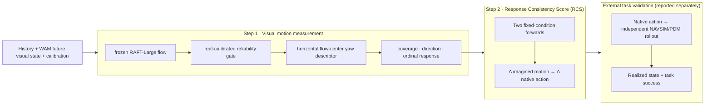

# IAC Benchmark: Imagined-future and Action Consistency

**Frozen benchmark:** **1,000 non-overlapping NAVSIM windows**

**Repository:** [RiseBun/IAC](https://github.com/RiseBun/IAC)

**中文文档:** [README_zh.md](README_zh.md)

**Joint evaluation framework:**
[`docs/WAM_JOINT_EVALUATION_FRAMEWORK_ZH.md`](docs/WAM_JOINT_EVALUATION_FRAMEWORK_ZH.md)

The machine-readable stages, input prohibitions and promotion gates are in
[`configs/wam_joint_evaluation_v1.json`](configs/wam_joint_evaluation_v1.json).

## Current visual layer and AS (2026-09-15)

The formal AS consumes `4 history + 4 future + 4 trajectory states`.
Reloc3r-512 reads visual yaw; Metric3Dv2-v2-S, static correspondences and
known-rotation PnP read coarse longitudinal progress.  The trajectory is joined
only after candidate-blind visual extraction.  SegFormer is auxiliary and is
not the sole correspondence backend.

The v1.2 report separates observable consistency from measurement coverage:

```text
AS_conditional   = 100 * sqrt(progress agreement on scored intervals
                              * yaw agreement on scored turns)
AS_observability = sqrt(progress score coverage * yaw score coverage)
AS_deployment    = AS_conditional * AS_observability
```

`AS_deployment` is the legacy-compatible coverage-aware summary and must not
be reported without the conditional score and both channel coverages.

After fixing the DriveWAM round-robin shard lineage join, the formal 1,490-row
result is:

| conditional AS | deployment AS | AS-yaw | conditional progress (interval) | progress score coverage |
|---:|---:|---:|---:|---:|
| **67.4 / 100** | 46.8 / 100 | 93.5% | 48.5% | 48.4% |

See [`docs/VISUAL_LAYER_AND_AS_ZH.md`](docs/VISUAL_LAYER_AND_AS_ZH.md) for the
frozen method and claim boundary, and
[`reports/as_reporting_decomposition_20260916.json`](reports/as_reporting_decomposition_20260916.json)
for the v1.2 decomposition. The original v1.1 result remains immutable in
[`reports/as_release_20260915.json`](reports/as_release_20260915.json).

## Historical flow-token readout (2026-09-14, retained for diagnosis)

This archived coarse readout was deliberately limited to
`stop / left / right / straight`. A candidate-blind RAFT-Large reader consumes
whole-clip visual motion; all thresholds and reliability rules are calibrated
on NAVSIM logged-real video only, never on generated video.

On 1,000 source-disjoint NAVSIM logged-real clips, coverage is `97.4%`, four-way
accuracy is `80.5%` (95% CI `[77.9%, 82.9%]`), and macro accuracy is `84.1%`.
Per-class recall is stop `100%`, left `82.9%`, right `81.0%`, and straight
`72.5%`. These are visual-reader accuracy measurements.

Generated video has no directly observed image-motion ground truth, so the WAM
rows below are alignment/response scores, not visual accuracy. MAS compares one
branch's visual token with its native action; RCS compares same-source left/right
visual and native-action differences.

| Model | MAS.direction coverage / alignment | RCS measurement coverage | RCS.direction | 95% source CI | Status |
|---|---:|---:|---:|---:|---|
| DriveWAM (255 pairs) | `96.9% / 77.9%` | `93.7%` | `86.2%` | `[80.4%, 91.3%]` | directional RCS pass |
| Epona (174 pairs) | `95.4% / 77.7%` | `94.3%` | `91.9%` | `[85.9%, 97.0%]` | directional RCS pass |
| DriveVA (50 pairs, verified shared actual seed) | `88.0% / 60.2%` | `82.0%` | `83.9%` | `[71.0%, 96.8%]` | signal present; CI/coverage gates fail |
| WorldDrive (10 selected strong-turn smoke pairs) | `100% / 100%` | `100%` | `100%` | Wilson `[72.2%, 100%]` | insufficient n; not a formal score |

The WAM rows are not all source-pool matched and therefore are not a strict
model leaderboard. The available counterfactual sets also contain no valid
stop-versus-moving twins, so `RCS.stop` is honestly `unavailable`; moving-only
agreement is not reported as stop recognition. The unified machine-readable
result is [`reports/flow_token_scorecard_20260914.json`](reports/flow_token_scorecard_20260914.json),
with the method and claim boundary documented in
[`docs/MAS_DIRECTION_STOP_AUDIT_ZH.md`](docs/MAS_DIRECTION_STOP_AUDIT_ZH.md).

IAC is an evaluation protocol for world action models (WAMs). It asks a
specific question: when a model emits a native action, is that action aligned
with the future visual state the model predicts? IAC separates measurement,
intervention consistency, and execution instead of collapsing them into a
single video-quality or task-success number.

This is a conditional evaluation standard, not a claim that every WAM is
future-driven. Each model and intervention is scored only in the evidence
channels it supports: a measurable inconsistency is a low score, while missing
or unsupported evidence is `unavailable` with a reason and is never converted
to zero. The protocol therefore remains meaningful for WAMs whose actions are
not generated from their predicted future.

This repository is the reproducible release package. It contains no raw
NAVSIM/Waymo frames, private ground truth, WAM checkpoints, or generated video.
Those inputs are attached by the evaluation server through the manifest
interface. Waymo is an external-domain protocol, not part of the leaderboard.

> **Protocol & code are reproducible; the published leaderboard numbers are
> reproduced on a private evaluation server with licensed data.** Per-sample
> DriveWAM outputs, private images, ground truth, and PDM caches are not
> redistributed, so the reference table cannot be independently recomputed
> from this repository alone.

The scorecard is deliberately conditional: it does not assume that every WAM
uses its predicted future to produce its action. MAS, RCS and GS are reported
independently with their own coverage; mediation is an optional causal audit.
An unsupported or unevaluable channel is `unavailable` with a reason; it is
excluded from that channel's score denominator, never converted to zero, and no
overall aggregate score is defined.

Every metric report exposes two separate quantities:
`conditional_score` (aggregation over units that pass the frozen evidence and
quality gates) and `score_coverage` (those scored units divided by all declared
units). `abstain`/`weak` means the probe was attempted but the unit was not safe
to score; `unavailable` means the capability or required reference was not
observable. Both remain in the coverage denominator and neither is a failure
score. This is essential for WAMs whose generated images are not consistently
future-driven: a high score on a narrow measurable subset must not be read as a
model-wide causal claim, while a low score with broad coverage is evidence of
observable inconsistency.
Legacy `pair_coverage`/`branch_coverage` fields remain useful as input-support
rates, but they are not a substitute for `score_coverage` when deadbands or
quality gates remove additional units; both must be reported.
The release also does not define a natural model-quality ranking: comparisons
are allowed only within the same metric with source-disjoint or paired
uncertainty, not by adding capability columns.

Independent simulator execution is reported as external task validation rather
than an IAC metric. It requires verified native-action provenance and realized
state, but it is never folded into the MAS/RCS/GS vector.

## Contributions

1. **Candidate-blind motion measurement.** The selected S1.3 path reads a frozen
   RAFT-Large flow field directly as an ordinal yaw response, without metric
   reconstruction or candidate trajectories. The continuous ground-plane SE(2)
   decoder remains an explicit, fail-closed diagnostic. Only yaw direction/rank
   enters the primary score.
2. **Capability-stratified metrics.** The canonical metrics are Motion Alignment
   Score (MAS; legacy CFAC), Response Consistency Score (RCS; legacy CCFC), and
   Grounding Score (GS; legacy FAU components).
   Each is an evidence column with its own coverage. Unsupported capabilities
   are `unavailable`, not zero-filled.
3. **Fail-closed reproducibility.** Exact timestamps, calibration, model
   revision, seed and lineage are required. Private GT is joined only on the
   evaluation server; submitted motion profiles cannot replace image probing.
   Model adapters may only declare the frozen orientation transform; the
   comparability validator also checks that MAS/RCS share the same calibration
   contract, descriptor, bootstrap and promotion gates.
4. **Structural counterfactual channel.** Same-source left/right flow
   differences are exposed as an ordinal, decoder-free signal for the Response
   Consistency Score (RCS; legacy structural CCFC-S). Source-disjoint calibration,
   reversed/identity/zero controls and clustered bootstrap are now recorded;
   The directional-yaw variant is now frozen for the release; metric-magnitude
   and progress variants remain diagnostic.

## Visual Evidence Layer v2 (implementation candidate)

The next protocol revision is defined by the evidence required by each metric,
not by a forced SE(2) trajectory. [`src/iac_new/visual_evidence_v2.py`](src/iac_new/visual_evidence_v2.py)
emits versioned, candidate-blind packets with interval descriptors, support,
backend agreement, uncertainty and explicit `scored`/`weak`/`unavailable`
states. [`src/iac_new/backend_adapters.py`](src/iac_new/backend_adapters.py)
freezes interfaces for RAFT/SEA-RAFT flow, CoTracker/TAPIR tracking and
optional UniDepth depth; the flow-chain tracker is an auditable archive
fallback, not a learned-tracker claim.

The v2 packet carries ordinal/structural evidence (`yaw_direction`,
`progress_order`, `lateral_direction`, relative magnitude, FOE, divergence,
curl, affine components and temporal persistence). MAS and RCS consume this
vector evidence independently; GS consumes generated/reference evidence with
identity and temporal controls. Future-to-action mediation requires paired,
independent intervention rollouts. Metric distance, absolute speed,
curvature and a free fitted trajectory remain diagnostic.

Archived flow profiles can be bridged without rerunning perception:

```text
python tools/build_visual_evidence_v2.py --manifest <flow_manifest.jsonl> --output <visual_evidence_v2.jsonl>
```

The frozen configuration is [`configs/visual_evidence_v2.json`](configs/visual_evidence_v2.json).
This channel is **not promoted** until source-disjoint confirmation on at least
three architectures clears the coverage, confidence-interval, reversed/zero
control and uncertainty gates. Legacy Step1/CFAC/CCFC outputs are retained
for compatibility and are diagnostic/deprecated only.

**Metric-first v4 output layer.** The current reconstruction adds
[`src/iac_new/visual_evidence_v4.py`](src/iac_new/visual_evidence_v4.py) and
[`configs/visual_evidence_v4.json`](configs/visual_evidence_v4.json). v4 does
not treat generic flow/appearance descriptors as action semantics: MAS requires
a frozen real-video calibration before emitting an action-aligned vector, RCS
requires normal/reversed/zero/identity controls before emitting a paired
response, and the optional mediation output exposes pathway evidence without
inferring causality. Missing evidence remains `unavailable` rather than zero.

## Archived legacy scorecard (2026-09-12)

These are archived legacy Step1/CFAC/CCFC reference results, retained for
comparison only. They are not the acceptance result for the v4 evidence layer.
Coverage and confidence intervals are part of every score; unavailable samples
are never zero-filled.

| Metric | Epona | DriveWAM | Interpretation |
|---|---:|---:|---|
| MAS-yaw pair coverage | 94.8% | 96.0% | visual yaw direction aligned with native action |
| MAS-yaw direction accuracy | 83.6% | 81.4% | source-bootstrap 95% CI: [79.4%, 87.6%] / [76.6%, 86.2%] |
| RCS-yaw pair coverage | 98.3% | 100.0% | same-source counterfactual pairs available |
| RCS-yaw direction accuracy | 92.4% | 85.8% | source-bootstrap 95% CI: [86.7%, 97.1%] / [79.0%, 92.4%] |
| GS coverage | 94.9% | 94.2% | external logged-future grounding |
| GS median | 0.550 | 0.191 | paired Epona−DriveWAM difference: 0.314 [0.251, 0.340] |

The archived MAS-yaw/RCS-yaw rows are structural/directional pilot claims, not
formal v4 promotion. The v4 promotion audit is currently blocked because the
required frozen real-video calibration, source-level controls (including zero
and identity controls), and external same-source GS references are incomplete.
Lateral translation, metric distance, absolute speed, curvature and
future-to-action mediation remain diagnostic or unavailable until their own
evidence gates pass.

The optional future-to-action mediation channel now has a frozen input contract
and scorer ([`configs/future_to_action_mediation_v1.json`](configs/future_to_action_mediation_v1.json),
[`tools/score_future_to_action_mediation.py`](tools/score_future_to_action_mediation.py)).
It requires a future-only perturbation and a pathway-blocked replica with the
same history, command, seed and model revision. Until a source-disjoint WAM
confirmation passes its preregistered suppression and specificity gates, the
channel is `unavailable`; MAS/RCS scores are not relabelled as causal evidence.

**Metric-first evidence packets.**  The score is only admissible when its
sample-level provenance is present.  `tools/build_metric_evidence_packets.py`
records model identity, native-action source, branch identity, same-source
counterfactual pairing, action deltas, and reversed/zero controls.  A
2026-09-12 replay produced MAS scored/weak/unavailable counts of 106/10/2 for
Epona and 148/20/4 for DriveWAM; RCS counts were 37/0/22 and 63/0/23.
Weak and unavailable rows remain explicit rather than being zero-filled.
These are evidence-completeness results, not new quality scores or causal
claims.
Every condition must also declare the same `wam_model_id` and explicit native
`action_source`; logged, oracle, proxy, candidate and staging trajectories are
rejected. This prevents an evaluator-supplied trajectory from being counted as
evidence that the WAM's own action pathway responded to the future.
The scorer also verifies intervention identity: every condition must carry a
future fingerprint and pathway state satisfying the pre-registered
baseline/perturbed and blocked/control relationships. A row label alone cannot
create causal evidence. It additionally requires a calibration-only, frozen
action normalization fingerprint and scale shared by all four conditions; a
small scored pilot is reported as `promotion.status=insufficient_evidence` and
cannot enable the causal claim. Promotion also requires an explicit calibration
source manifest and source-disjoint confirmation; omitting that manifest keeps
the result at `insufficient_evidence`.

A WorldDrive internal future-latent permutation pilot is archived at
[`reports/future_to_action_worlddrive_pilot_20260912.json`](reports/future_to_action_worlddrive_pilot_20260912.json).
It changed the selected action/trajectory in 11/25 groups, but only 1/25
passed the material lateral/yaw gate. Since the pilot has no blocked-pathway
replica, fixed-action control, source-disjoint confirmation set, or 30 material
sources, it is pathway-response evidence only—not a future-to-action causal
result. The mediation channel therefore remains `unavailable` for formal
scoring.

The same four conditions now also have an **outcome** scorer. A marginal
execution success rate cannot distinguish a model that acts on its predicted future from one that
ignores it, because both the baseline and the perturbed arm are averaged
together. [`tools/score_conditional_foresight.py`](tools/score_conditional_foresight.py)
instead reports the paired same-source contrast
`success(future_perturbed) − success(baseline)` together with the blocked-pathway
attribution arm and the fixed-action specificity arm, plus a **dose-response**
monitor that separates "the model ignores its future" from "the probe barely
moved the action." Status is `implemented_evidence_pending`: no rollout data for
these four conditions exists yet, so no causal claim is enabled.

Two source-level questions can be answered without any new model runs, from
tables the frozen reports already contain.
[`tools/analyse_joint_source_table.py`](tools/analyse_joint_source_table.py)
joins per-source consistency scores (MAS/RCS) with per-source independent
execution outcomes and reports a source-level bootstrap Spearman, a
deterministically shuffled null control, and the distance of the consistency
score from its chance level (0.5 for the ordinal direction scores). This is the
cheapest falsification the protocol has: if the consistency channels carry no
information about task success, that is visible before any further investment.
A null result is reported as `no_association_detected`, not as a zero score.

The release does **not** claim a new optical-flow architecture. The novelty is
the leakage-resistant measurement and scoring protocol built around a frozen,
audited flow component.

To verify the public scorer without private benchmark data, run the synthetic
replay fixture:

```bash
python tools/score_structural_grounding.py \
  --generated datasets/public_gs_fixture_generated.jsonl \
  --reference datasets/public_gs_fixture_reference.jsonl \
  --scales configs/gs_public_fixture_scales.json \
  --output /tmp/gs_public_fixture.json
```

It should report one evaluated source, one reference-only source, coverage
`1.0`, and median `1.0`. This verifies the public implementation and its
missing-value semantics; it is deliberately not a substitute for the private
logged-future reference used by the benchmark table.

An evaluation server that wants to make real GS scores independently
recomputable can export a descriptor-only reference release with
[`tools/export_gs_reference_release.py`](tools/export_gs_reference_release.py).
The published bundle can be checked without the HMAC salt using
[`tools/verify_gs_reference_release.py`](tools/verify_gs_reference_release.py);
the verifier rejects raw source keys, images, trajectories and unknown fields.
The exporter HMAC-pseudonymizes source keys and drops images, calibration, ego
states, trajectories and private paths. The current benchmark reference stays
private; this is the safe publication path, not a claim that private GT is
already public.

The machine-readable release boundary is recorded in
[`reports/release_readiness_20260912.json`](reports/release_readiness_20260912.json):
the package is publishable as a conditional consistency/grounding standard, but
does not claim future-to-action causality until mediation evidence is supplied.
Run [`tools/validate_release_readiness.py`](tools/validate_release_readiness.py)
before publishing a new scorecard; it fails closed if these boundaries drift.

The current two-model result has a deliberately narrow scope. Epona and
DriveWAM validate the protocol on two declared model families; they do **not**
justify an architecture-universal claim. The machine-readable claim scope is
`two_model_protocol_validation_only`. A universal architecture claim is disabled
until at least three distinct architecture families pass the pre-registered
gate. DriveVA and WorldDrive remain diagnostic/pilot evidence and cannot be
silently promoted by adding their names to a report.

An independent same-source channel audit tested five decoder-free descriptors on
174 matched intervention sources. Only `horizontal_flow_center` passed the
two-model direction gate; flow magnitude, vertical center, divergence and curl
did not. The negative result is part of the release boundary, not an omitted
experiment: those channels remain diagnostic until a new intervention and
calibration demonstrate otherwise. See
[`reports/structure_channel_audit_20260912.json`](reports/structure_channel_audit_20260912.json).

## Three-step protocol



### Step 1: visual motion measurement

The selected S1.3 path bypasses metric SE(2) reconstruction: it aggregates the
reliable horizontal-flow center over common intervals and tests whether its
left/right change follows the native-action yaw change. Its frozen entry point
is [`configs/flow_structure_yaw_v1_3.json`](configs/flow_structure_yaw_v1_3.json).
The continuous Step 1.2 contract below is retained as a metric-reconstruction
diagnostic, not cascaded or fused into S1.3. The candidate-blind coarse
initializer G is an experimental ablation of that diagnostic path.

The restored Step 1.2 contract uses evaluator images at `448×256`, explicitly
declares that calibration comes from `1920×1080`, runs RAFT at `512×288`, and
maps flow and intrinsics into evaluator coordinates. Its frozen configuration is
[`configs/plane.json`](configs/plane.json):

```text
future RGB (or a fixed, checksummed latent decoder)
  → RAFT-Large forward/backward flow
  → consistency mask + spatially stratified road sampling
  → candidate-blind continuous SE(2) fit
  → output projection support + improvement over zero flow
  → explained / weak / abstain
  → primary yaw direction and paired ordinal response
```

`measurement_available` requires output projection support at all four future
intervals. `explained` additionally requires at least `0.05` energy improvement
over the zero-flow baseline. A branch is scored only when it is `explained`; a
CCFC pair requires both branches to be `explained`. Lateral, curvature, distance,
and speed remain diagnostics because their held-out amplitude audits failed.

The real-frame calibration audit resolves logged GT from each sample's source
pickle and verifies that `future_trajectory` matches the recorded realized ego
state. On material endpoints, median readout ratios are `0.916` for yaw, `0.480`
for lateral displacement, and `0.565` for longitudinal displacement. Yaw has
`116/117 = 99.1%` direction accuracy and `0.918` Spearman, including 91
lateral-turn samples. Generated branches never label the WAM action head as GT;
the protocol rejects that identity and accepts a GT pointer only with an
explicit trusted realized-trajectory source.

DriveWAM input pickles now fail closed on the model's native temporal contract:
`[current, future_0.5s, ..., future_4.0s]`. Earlier generated results used a
misaligned `4 history + 8 future` array and are withdrawn. On the regenerated
255-pair set, single-branch all-interval projection coverage is
`459/510 = 90.0%` and explained coverage is `380/510 = 74.5%`. Pair coverage
is `218/255 = 85.5%` for projection and `171/255 = 67.1%` for both branches
explained. Among 106 pairs with at least `0.01 rad` native-action yaw separation,
direction accuracy is `87/106 = 82.1% [73.7%, 88.2%]`; Spearman is
`0.832 [0.731, 0.902]`.

A candidate-blind coarse initializer is retained as the Step 1.3-G ablation. It
raises explained pair coverage to `205/255 = 80.4%` and Spearman to `0.925`
without degrading the shared-pair direction result; on real logged frames it
also raises explained coverage from `217/255` to `231/255` and yaw Spearman
from `0.918` to `0.992`. It remains experimental because strict pair coverage
is below 90%. The reconstruction-free S1.3 yaw pilot reaches `254/255 = 99.6%`
pair coverage, `126/149 = 84.6% [77.9%, 89.5%]` direction accuracy and `0.779`
Spearman. S1.3 is therefore the sole selected Step 1 execution path; Step 1.2
and 1.3-G are retained only as metric diagnostics and are not cascaded or fused
into its score. The frozen entry point is
`configs/flow_structure_yaw_v1_3.json`.

S1.3 was then tested on the same 174 sources and exact action interventions in
DriveWAM and Epona. Pair coverage was `100%` versus `97.7%`, direction accuracy
was `85.7%` versus `92.4%`, and Spearman was `0.805` versus `0.739`; the natural
quality differences do not exclude zero. Because two naturally generated WAMs
need not differ, model separation is reported but is not treated as validity.
The original separation promotion gate remains failed; it is not retroactively
marked as passed.

A positive control was preregistered before execution: only the left/right
future-video contrast was reduced to `100% / 50% / 0%`, with actions, sources,
history, calibration and thresholds fixed. Coverage stayed above `97%` on both
WAMs, while median response strictly decreased to zero; at zero contrast,
Spearman became unavailable. S1.3 is therefore validated as a cross-WAM
**action-response measurement**, not as a natural WAM quality ranking or
logged-GT fidelity metric. The frozen protocol hash is unchanged; aggregate
validation is recorded in `configs/flow_structure_yaw_v1_3_validation.json`.
The off-the-shelf SEA-RAFT A/B is rejected.

An independent pure-speed twin audit tested five candidate non-yaw descriptors
(`horizontal_flow_center`, `vertical_flow_center`, `median_flow_magnitude_px`,
`divergence`, and `curl`) against trajectory path-length swaps. Coverage was
adequate (`94.9%` Epona, `100%` DriveWAM), but no descriptor passed the frozen
promotion gate (two models, bootstrap direction lower bound `≥75%`). The best
single-model result was Epona flow magnitude (`76.8%`, CI lower `64.2%`), while
DriveWAM was near chance (`51.3%`). Progress/speed therefore remains diagnostic;
this is evidence against the current representations, not proof that no
decoder-free progress signal can ever be constructed. Details are in
[`reports/progress_structure_pure_speed_audit_20260912.json`](reports/progress_structure_pure_speed_audit_20260912.json).

An additional exploratory structural channel is defined in
[`configs/flow_structure_counterfactual_delta_v1.json`](configs/flow_structure_counterfactual_delta_v1.json).

The current structural forward-consistency candidate is specified in
[`configs/ccfc_structure_forward_v1.json`](configs/ccfc_structure_forward_v1.json).
It compares the left/right video flow difference with the flow induced by the
corresponding action trajectories, and reports direction, response gain,
temporal persistence, and normal/reversed/zero controls. It deliberately does
not reconstruct metres or treat unavailable projection support as zero.
For the same `source_key`, it computes

```text
ΔS_F = S_F(left) − S_F(right)
```

and reports raw/common-motion-normalized deltas, direction and temporal
persistence without reconstructing metres or radians. It can support the
structural `RCS`, but it does not replace metric `MAS` or `GS`; progress
descriptors remain diagnostic until the independent pure-speed swap validation
is complete.

### Step 2: Motion Alignment (MAS) and Response Consistency (RCS)

**Motion Alignment Score (MAS; legacy CFAC)** compares one run's imagined motion
profile `P_F` with its native action profile `P_A`. **Response Consistency Score
(RCS; legacy CCFC)** compares the changes produced by two reproducible
forwards with the same history, seed and nuisance variables:

```text
ΔS_F = S_F(branch 1) − S_F(branch 0)
ΔP_A = P_A(branch 1) − P_A(branch 0)
RCS = ordinal_consistency(ΔS_F, ΔP_A)
```

`RCS` is the structural form used by the current framework. It measures
whether imagined structure and native action respond consistently to the same
intervention; it is not by itself proof that the action was causally generated
from the predicted future. A future-to-action claim requires an additional
future-only intervention or pathway-ablation control (see the framework
document).

Any auditable intervention is allowed (for example left/right, slow/fast,
command change or latent swap). Semantic clear/risk is optional. The evaluator
must receive both regenerated future visual output and native action; injecting
an action after generation is only an action-response diagnostic, not CCFC.

The Grounding Score (GS) reports whether imagined motion and native
action approach the private ground-truth future. Its compatibility components
remain `FAU_F` and `FAU_A`, with legacy `FAU = sqrt(FAU_F × FAU_A)`.

`MAS` in the structural domain requires an action-to-structure
mapping fitted on a separate calibration set and frozen before confirmation.
Until that calibration is validated, it must be reported as `unavailable`, not
as a metre-domain error. The executable pilot bundle is recorded in
[`reports/wam_three_metric_pilot_20260911.json`](reports/wam_three_metric_pilot_20260911.json).

The current cross-model pilot scorecard is recorded in
[`reports/ccfc_structure_forward_scorecard_20260911.json`](reports/ccfc_structure_forward_scorecard_20260911.json).
The same candidate separates a strong response (WorldDrive eval25 extension:
direction cosine `0.998`, temporal persistence `1.0`, response gain `1.469`)
from weak or absent responses (DriveVA: `0.129`/`0.061`; DriveWAM:
`0.016`/`0.0045`). These are pilot diagnostics, not promotion results: the
formal promotion remains subject to the frozen protocol gates and held-out
real-video calibration. GS is the exception: its real-only calibration,
source-disjoint generated calibration, and source-cluster confirmation bootstrap
have passed the frozen GS gates and are recorded in
`configs/wam_three_metric_protocol_v1.json`.

### 关键有效性证据与当前模型分数（2026-09-12）

下面把“证明测量器有效的控制结果”和“模型本身的分数”分开报告。所有数值都
保留 coverage；不可测样本为 `unavailable`，不填零。

**Step 1 / MAS 选择依据（冻结 S1.3 yaw pilot）**

在 255 个配对 source 上，pair coverage 为 `254/255 = 99.6%`，yaw 方向准确率
为 `126/149 = 84.6%`（95% CI `[77.9%, 89.5%]`），Spearman 为 `0.779`。
这是测量器的方向与排序有效性证据；lateral、纵向距离、速度和曲率仍是
diagnostic，不进入 primary。

**RCS：反事实响应分数（旧 CCFC）**

| 模型 | coverage | 正常方向 cosine | 反转 cosine | response gain | temporal persistence |
|---|---:|---:|---:|---:|---:|
| Epona | 100% | `+0.416` | `−0.416` | `0.232` | `1.00` |
| DriveWAM | 100% | `+0.016` | `−0.016` | `0.0045` | `0.50` |
| WorldDrive (eval25) | 100% | `+0.998` | `−0.998` | `1.469` | `1.00` |
| DriveVA | 100% | `+0.129` | `−0.129` | `0.061` | `0.786` |

正常/反转控制符号相反，且零差异控制不产生方向分数；这是 RCS 的核心有效性
证据。该表是 structural pilot 分数，不是米制轨迹精度。

**Frozen RCS-yaw variant.**  The same-source difference in
`horizontal_flow_center` is compared with the native yaw intervention.  Its
orientation and deadband are frozen from logged real future flow, and the
uncertainty interval is bootstrapped over source/twin units:

| Model | twin coverage | direction accuracy | source-bootstrap 95% CI | reversed-action accuracy |
|---|---:|---:|---:|---:|
| Epona | `98.3%` | `92.4%` | `[86.7%, 97.1%]` | `7.6%` |
| DriveWAM | `100%` | `85.8%` | `[79.0%, 92.4%]` | `14.2%` |

Both models pass the frozen RCS-yaw gates.  Pure-speed progress RCS remains a
separate diagnostic because its DriveWAM result is near chance; it is not
silently folded into the yaw score.

The dimension contract is explicit: the frozen MAS/RCS cells validate only
ordinal yaw direction/response. Speed, longitudinal distance, lateral
displacement, and curvature are still `diagnostic_only`, while a complete
metric trajectory is `unavailable`. A downstream score must not treat those
diagnostic fields as hidden components of MAS/RCS or infer a full-trajectory
claim from a yaw score.

To broaden Step 1 beyond the current yaw adapter, the repository now contains
an experimental `Step1 Universal Response` contract. It uses same-source
action contrasts, robust common-mode normalization, temporal persistence, and
normal/reversed/identity/zero controls. It is deliberately not promoted yet:
each channel must independently pass source-disjoint calibration, the 0.90
coverage gate, the 0.75 bootstrap lower-bound gate, and confirmation on at least
three architecture families. See
[`docs/STEP1_UNIVERSAL_RESPONSE_DESIGN_ZH.md`](docs/STEP1_UNIVERSAL_RESPONSE_DESIGN_ZH.md)
and [`configs/step1_universal_response_v1.json`](configs/step1_universal_response_v1.json).
The first bridge audit over existing Epona, DriveWAM, DriveVA and WorldDrive
twin-control artifacts is recorded in
[`reports/step1_universal_response_real_control_audit_20260912.json`](reports/step1_universal_response_real_control_audit_20260912.json).
That bridge is not a raw rerun and is retained only for provenance. The raw-flow
four-control rerun is recorded in
[`reports/step1_universal_response_raw_control_audit_20260912.json`](reports/step1_universal_response_raw_control_audit_20260912.json)
and its reproducible entry points are
[`tools/run_raw_universal_response_controls.py`](tools/run_raw_universal_response_controls.py)
and [`tools/audit_raw_universal_response_controls.py`](tools/audit_raw_universal_response_controls.py).
Only WorldDrive passes all current pilot gates; Epona, DriveWAM and DriveVA fail
coverage, direction-CI, or sample-size gates. The new channel therefore remains
experimental with zero architecture-universal promotion, as required by the
three-architecture gate.

Step1 is now being refactored as a shared evidence layer rather than a single
yaw or metric-trajectory decoder. The experimental interface exposes temporal
motion, same-source counterfactual response, generated/reference grounding, and
reliability/abstention evidence independently. MAS, RCS and GS consume the
relevant evidence product; causal claims still require a separate future-only
pathway intervention. Metric depth is optional and may improve validity or grounding
diagnostics, but it is not required and cannot fill missing visual evidence.
See [`src/iac_new/step1_evidence.py`](src/iac_new/step1_evidence.py) and
[`configs/step1_evidence_layer_v1.json`](configs/step1_evidence_layer_v1.json).

**GS：现实几何保真度分数（旧 FAU 组件）**

GS 使用同源 logged future 作为外部参考，尺度只由 real-only calibration 冻结，
再按 source/twin 原子 bootstrap：

| 模型 | GS 中位数 | 95% source-cluster CI | coverage |
|---|---:|---:|---:|
| Epona | `0.550` | `[0.487, 0.635]` | `94.9%` |
| DriveWAM | `0.191` | `[0.158, 0.215]` | `94.2%` |

Epona − DriveWAM 的 paired 差值为 `0.314`，95% CI `[0.251, 0.340]`；这证明
GS 能在两个模型之间区分真实运动结构保真度。该结果不单独证明
future-to-action 因果关系；该因果问题只能由独立的 mediation 实验回答。

GS 的 source-disjoint generated calibration 为 `230` 个分支，coverage `98.3%`，
中位数 `0.503`；随机身份置换均值 `0.289`（95% 上界 `0.303`）。详细审计见
[`reports/grounding_score_bootstrap_20260912.json`](reports/grounding_score_bootstrap_20260912.json)
和 [`reports/grounding_score_candidate_20260911.json`](reports/grounding_score_candidate_20260911.json)。

GS 的重算入口是
[`tools/score_structural_grounding.py`](tools/score_structural_grounding.py)。它接收
生成流结构 JSONL、外部参考未来 JSONL 和冻结的 descriptor scales（流幅度尺度在
`log1p` 域）；参考未来可以由
评测方保留在私有环境，缺失 interval 会记为 `unavailable`，绝不会用零填充。因而
协议和代码可独立复现，公开仓库仍不泄露 NAVSIM/Waymo 图像或 GT。

```text
python tools/score_structural_grounding.py \
  --generated generated_flow_structure.jsonl \
  --reference logged_future_flow_structure.jsonl \
  --scales configs/gs_descriptor_scales.json \
  --output gs_report.json
```

**MAS structural diagnostic（尚未作为正式排行榜分数）**

| 模型 | interval coverage | reliable fraction | median residual (px) | direction cosine |
|---|---:|---:|---:|---:|
| Epona | `11.0%` | `4.0%` | `5.35` | `0.356` |
| DriveWAM | `24.1%` | `0%` | `62.07` | `0.220` |
| WorldDrive (eval25) | `26.9%` | `5.0%` | `6.32` | `0.851` |
| DriveVA | `21.3%` | `2.5%` | `13.32` | `0.313` |

这组结果说明直接把结构流拟合成 action-aligned MAS 仍受模型域差异影响，
不能与上面的 RCS/GS 分数混排；它保留作诊断和后续校准依据。

**Frozen MAS-yaw variant.**  The metric scope is now explicitly directional:
the median `horizontal_flow_center` sign over a branch is compared with the
sign of the native terminal yaw.  Orientation and deadbands are frozen from
logged real future flow; source-level bootstrap is used for confirmation.  This
avoids metric trajectory reconstruction, but it must not be interpreted as a
metre-domain motion score.

| Model | twin coverage | direction accuracy | source-bootstrap 95% CI | reversed-action accuracy |
|---|---:|---:|---:|---:|
| Epona | `94.8%` | `83.6%` | `[79.4%, 87.6%]` | `16.4%` |
| DriveWAM | `96.0%` | `81.4%` | `[76.6%, 86.2%]` | `18.6%` |

Both models pass the frozen MAS-yaw gates (coverage ≥90%, bootstrap lower
bound ≥75%).  Progress, speed, lateral displacement, curvature, and absolute
trajectory alignment remain diagnostic-only.  Full artifacts are
[`configs/mas_yaw_v1.json`](configs/mas_yaw_v1.json),
[`reports/mas_yaw_epona_20260912.json`](reports/mas_yaw_epona_20260912.json),
[`reports/mas_yaw_drivewam_20260912.json`](reports/mas_yaw_drivewam_20260912.json),
and [`tools/score_mas_yaw_direction.py`](tools/score_mas_yaw_direction.py).

Model adapters may calibrate coordinate orientation only. The descriptor,
deadbands, coverage gates and aggregation are shared across models and must be
frozen before the source-disjoint confirmation split, preventing model-specific
adapter tuning from becoming a hidden optimization channel.
The machine-checkable contract can be checked with
`python tools/validate_metric_comparability.py configs/mas_yaw_v1.json configs/rcs_yaw_v1.json`.

An independent, candidate-blind action-to-structure calibration was also
run using logged real future flow only, then applied once to untouched pure-
speed generated confirmations.  It is an audit of the MAS interface, not a
promotion result:

| Model | branch coverage | median MAS | median zero baseline | fast-vs-slow order |
|---|---:|---:|---:|---:|
| Epona | `95.0%` (112/118) | `0.550` | `0.650` | `36.0%` (56 twins) |
| DriveWAM | `100%` (172/172) | `0.270` | `0.350` | `7.0%` (86 twins) |

Both models score below the zero-action baseline and fail the preregistered
transportability requirement.  This is evidence that the current
action-to-structure adapter is not yet a reliable MAS; the result is retained
as a negative control and does not alter the frozen RCS or GS claims.  The
reproducible artifacts are
[`reports/mas_independent_epona_20260912.json`](reports/mas_independent_epona_20260912.json),
[`reports/mas_independent_drivewam_20260912.json`](reports/mas_independent_drivewam_20260912.json),
and [`tools/calibrate_mas_structure.py`](tools/calibrate_mas_structure.py).

A NeuFlow-only backbone check on the same pure-speed twins did not rescue the
signal: fast-vs-slow ordering was `69.5%` for Epona and `43.0%` for DriveWAM.
The artifacts are [`reports/neu_flow_structure_epona_20260912.json`](reports/neu_flow_structure_epona_20260912.json)
and [`reports/neu_flow_structure_drivewam_20260912.json`](reports/neu_flow_structure_drivewam_20260912.json).

### External task validation

This optional validation sends native action to an independent simulator and scores the realized
state and task label. The rollout never reads generated future images, and a
WAM waypoint is never treated as realized state. Without a compatible rollout
or task label, external validation is `unavailable`.

The independent DriveWAM rollout is available as a public aggregate audit:
`978` executable rows and `503` successes, with zero rollout errors.
The fail-closed scorer gives coverage `1.000` and a Wilson 95% CI of
`[0.4830, 0.5455]` for the success rate.
The simulator used realized state and verified action injection without reading
generated future images. This is external single-model task evidence and does
not establish future-to-action mediation. See the historical artifact
[`reports/independent_execution_drivewam_summary_20260912.json`](reports/independent_execution_drivewam_summary_20260912.json).
The reusable fail-closed scorer is [`tools/score_independent_execution.py`](tools/score_independent_execution.py):
it requires explicit task labels and their simulator provenance, stable source
keys, verified native-action injection, and independent realized state, and reports missing rows as
`unavailable` rather than failures.

That number is marginal, not conditional. To condition success on the model's
own predicted future, run the same simulator over the four conditions of
[`configs/future_to_action_mediation_v1.json`](configs/future_to_action_mediation_v1.json)
and score them with [`tools/score_conditional_foresight.py`](tools/score_conditional_foresight.py):

```bash
python tools/score_conditional_foresight.py <four_condition_rollouts.jsonl> \
  --require-dose-response --output reports/conditional_foresight.json
```

```bash
# Source-level join: do high-consistency sources also succeed more often?
python tools/analyse_joint_source_table.py \
  --rcs <per_source_rcs.jsonl> \
  --execution <per_source_rollout.jsonl> \
  --output reports/joint_source_analysis.json
```

## Benchmark dataset

The frozen main split is [`datasets/benchmark_public.jsonl`](datasets/benchmark_public.jsonl):

| Property | Frozen value |
|---|---:|
| Samples | 1,000 NAVSIM windows |
| History | 4 frames, `t ≤ 0` |
| Future reference axis | 8 frames, `0.5 … 4.0 s` |
| Straight cruise | 300 (30% hard cap) |
| Lateral turn | 503 |
| Acceleration | 82 |
| Braking | 65 |
| Stop | 50 (5% cap) |
| Scene groups | 675 |
| In-scene window separation | ≥12 frames |

Selection and leakage audits are in
[`docs/BENCHMARK_PROTOCOL_AUDIT_ZH.md`](docs/BENCHMARK_PROTOCOL_AUDIT_ZH.md).

## Reference DriveWAM run (historical pre-fix artifact)

The first complete pilot used DriveWAM with the native LingBot-VA base. These
values are the original pre-projection-gate artifact. They are retained for
provenance only, not as valid benchmark scores or an oracle. The generated
clips in this historical run were pre-resized while carrying calibration for
the original image size; runs made before the explicit
`intrinsics_source_size` contract must not be compared with corrected Step 1-S
results:

| Column | Score | Validity |
|---|---:|---|
| CFAC (shape composite) | 0.7638 | 823/1,000 |
| CCFC (arc-relative command intervention) | 0.2178 | 453/1,000 pairs |
| FAU_F | 0.5449 | 823/1,000 |
| FAU_A | 0.4904 | 823/1,000 |
| FAU | 0.5169 | 823/1,000 |
| External execution success (not an IAC metric) | 0.5143 | 503 successes / 978 executable rows |

Aggregate provenance and the private artifact contract are documented in
[`docs/DRIVEWAM_BENCHMARK_RESULTS_ZH.md`](docs/DRIVEWAM_BENCHMARK_RESULTS_ZH.md).
The DriveVA model-level negative result and the blinded human root-cause audit
protocol are documented in
[`docs/DRIVEVA_HUMAN_AUDIT_PROTOCOL_ZH.md`](docs/DRIVEVA_HUMAN_AUDIT_PROTOCOL_ZH.md).
The S1.3 audit findings and the CCFC-S/CFAC-S roadmap are documented in
[`docs/STEP1_S1_3_AUDIT_AND_METRIC_ROADMAP_ZH.md`](docs/STEP1_S1_3_AUDIT_AND_METRIC_ROADMAP_ZH.md).
The prioritized Step1.3 depth/flow improvement plan and preregistered gates are
in [`docs/STEP1_IMPROVEMENT_PLAN_ZH.md`](docs/STEP1_IMPROVEMENT_PLAN_ZH.md).
The per-sample result files are not part of the public release.

## Repository layout

```text
configs/       frozen evaluator configuration (`plane.json`)
datasets/      public manifest, split audit and scorecard schema
docs/          protocol, dataset, metric and reproducibility specifications
scripts/       submission audit, manifest builders and evaluation entrypoints
src/iac_new/   reusable flow, geometry, decoder and scoring library
reproduction/  model-specific DriveWAM and NAVSIM/PDM reproduction helpers
tools/         licensed-dataset construction utilities (not needed to submit)
tests/         deterministic unit and protocol tests
weights/       frozen RAFT-Large checkpoint, provenance and SHA-256
```

Raw data, private GT, generated videos, WAM weights and server paths are
intentionally excluded.

## Install and verify

```bash
python -m pip install -e .
PYTHONPATH=src:. python -m pytest -q
(cd weights && sha256sum -c SHA256SUMS.txt)
```

## Submit and score a WAM

Each row must match a public `sample_id` and contain native action, future RGB
(or decoder-reconstructable latent), exact future timestamps, calibration, seed,
model revision and lineage. At least four future points must cover approximately
four seconds; the native axis is preserved (DriveWAM's four points at 1 Hz is
valid). Future images and private GT are never included in the public manifest.

```bash
python scripts/validate_wam_submission.py \
  --public datasets/benchmark_public.jsonl \
  --submission <submission.jsonl> \
  --output <audit.json>

python scripts/score_iac_submission.py \
  --public datasets/benchmark_public.jsonl \
  --submission <submission.jsonl> \
  --measurements <server_measurements.json> \
  --output <scorecard.json>
```

The server-only Step 1 command consumes a private joined manifest. The frozen
execution path is S1.3 (`configs/flow_structure_yaw_v1_3.json`); the continuous
SE(2) decoder (`scripts/evaluate_continuous_decoder.py` with
`configs/plane.json`) and Step 1.3-G remain diagnostic/ablation paths. Paired
aggregation uses `scripts/evaluate_counterfactual_alignment.py`. The public manifest alone cannot
access images or GT. Capability status is one of
`pass`, `pilot`, `unavailable`, `missing` or `ineligible`.

## License, citation and data

- Code: [MIT License](LICENSE)
- Cite: see [`CITATION.cff`](CITATION.cff)
- RAFT checkpoint: upstream torchvision terms ([`weights/README.md`](weights/README.md))
- NAVSIM / Waymo raw data are **not** redistributed; obtain them under their own licenses

Python package name on PyPI-style installs is `iac-benchmark`; the import path
remains `iac_new` for compatibility with the frozen evaluation scripts.
