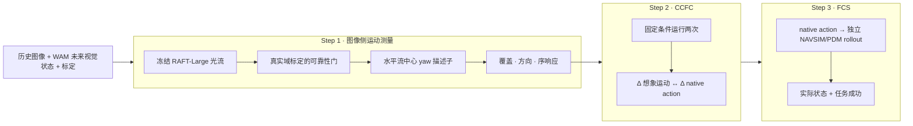

# IAC Benchmark：想象未来—动作一致性评测

**冻结评测集：** **1,000 条非重叠 NAVSIM 窗口**

**仓库：** [RiseBun/IAC](https://github.com/RiseBun/IAC)

**English:** [README.md](README.md)

IAC 是面向世界动作模型（WAM）的评测协议，回答一个明确问题：模型输出的
native action，是否与模型预测的未来视觉状态一致？IAC 将图像测量、干预一致性和
独立执行分开报告，不把视频质量或任务成功率误当成同一个指标。

完整的联合评测方法、数据契约、指标边界和待验收扩展见
[`docs/WAM_JOINT_EVALUATION_FRAMEWORK_ZH.md`](docs/WAM_JOINT_EVALUATION_FRAMEWORK_ZH.md)。
机器可读的阶段、输入禁止项和 promotion gate 见
[`configs/wam_joint_evaluation_v1.json`](configs/wam_joint_evaluation_v1.json)。

本仓库是可复现发布包，不包含 NAVSIM/Waymo 原始图像、私有真值、WAM 权重或生成
视频。评测服务器通过 manifest 接口挂载这些输入。Waymo 只作为外部域泛化协议，
不进入主榜分母。

> **协议与代码可复现；公开榜单中的参考分数由私有评测服务器使用许可数据复现。**
> 逐样本 DriveWAM 输出、私有图像、GT 和 PDM cache 不公开，因此只依靠本仓库不能
> 独立重算下方参考主表。

## 方法贡献

1. **候选盲运动测量尺：** 当前选定的 S1.3 直接把冻结 RAFT-Large 流场读成
   yaw 的序响应，不做米制重建，也不读取候选轨迹。连续地平面 SE(2) decoder
   保留为显式、失败关闭的 diagnostic。只有 yaw 方向/排序进入 primary。
2. **能力分层指标：** CFAC、CCFC、FAU、FCS 作为独立证据列并报告各自 coverage；
   模型不支持某项时记为 `unavailable`，不填 0。
3. **失败关闭与可复现：** 强制精确时间戳、标定、随机种子、模型版本和 lineage；
   私有 GT 只在评测端 join，作者提交的运动剖面不能替代图像侧探针。

本发布版不宣称提出新的光流网络。创新点是围绕冻结、审计过的光流组件建立了防
泄漏的测量和评分协议。

## 三步流程



### Step 1：图像侧运动测量

当前选定的 S1.3 绕过米制 SE(2) 重建：在共同有效 interval 上汇总可靠的水平
流中心，并检验左右变化是否跟随 native-action yaw 变化。冻结入口为
[`configs/flow_structure_yaw_v1_3.json`](configs/flow_structure_yaw_v1_3.json)。
下述 Step 1.2 仅保留为米制重建 diagnostic，不与 S1.3 级联或融合。

恢复后的 Step 1.2 坐标约定为：评测图像 `448×256`，内参显式声明来自
`1920×1080`，RAFT 推理 `512×288` 后把光流和内参统一映射回评测坐标。冻结配置为
[`configs/plane.json`](configs/plane.json)：

```text
未来 RGB（或固定且有 checksum 的 latent decoder）
  → RAFT-Large 前后向光流
  → 前后向一致性 + 道路中远场空间分层取点
  → candidate-blind 连续 SE(2) 拟合
  → 输出投影支持 + 相对零流改善
  → explained / weak / abstain
  → primary yaw 方向与成对序响应
```

`measurement_available` 要求四个未来 interval 均有足够的输出投影支持；
`explained` 还要求拟合能量比零流基线至少改善 `0.05`。单分支只有 `explained`
才能计分，CCFC 还要求左右两支都 `explained`。lateral、curvature、纵向距离和速度
继续输出，但只作 diagnostic。沿每条样本的 `lineage.source_sample` 读取 NAVSIM
pickle，并核对 `future_trajectory` 与 `realized_future_ego_state` 后，真实 RGB 的
logged-GT 审计得到 yaw 末点读出比例中位数 `0.916`；lateral/longitudinal 为
`0.480/0.565` 且离散度过大。117 条 material-yaw 样本中方向命中
`116/117 = 99.1%`、Spearman `0.918`；其中包含 91 条 lateral-turn。该结果验证
真实图像域的 yaw 尺子，不代表生成反事实与现实 GT 相同。

旧 DriveWAM manifest 曾把 `gt_candidate_id` 错指向 `wam_action_head`。Step 1.2
现在拒绝这种记录；生成分支不设置 GT 指针，只有带显式可信来源的私有 realized
轨迹才能声明为 GT。配置中的顶层内参尺寸也不能替代逐样本
`intrinsics_source_size`。

DriveWAM 输入现在还会校验模型的原生时间契约：
`[current, future_0.5s, ..., future_4.0s]`。早期输入误把 4 帧历史也放进该数组，
导致模型条件时刻与动作锚点错位；依赖那批生成帧的结果均已撤回。重生成的 255 对
中，单分支四时刻投影覆盖为 `459/510 = 90.0%`，单分支 explained 为
`380/510 = 74.5%`；成对口径为四时刻都可投影 `218/255 = 85.5%`、两支都
explained `171/255 = 67.1%`。动作 yaw 差至少 `0.01 rad` 的 106 对中，方向
命中 `87/106 = 82.1% [73.7%, 88.2%]`，Spearman 为
`0.832 [0.731, 0.902]`。

候选无关的粗网格初始化 G 是 Step 1.3 消融：它把双支 explained 覆盖提到
`205/255 = 80.4%`，并把 yaw Spearman 提到 `0.925`；真实帧 explained 也由
217/255 提到 231/255，yaw Spearman 由 0.918 提到 0.992。无需米制重建的
S1.3 yaw pilot 达到 `254/255 = 99.6%` pair coverage、
`126/149 = 84.6% [77.9%, 89.5%]` 方向准确率和 `0.779` Spearman。

严格跨模型对照在相同 174 个 source 上，把 DriveWAM 的实际动作干预逐条注入
Epona。pair coverage 为 `100% / 97.7%`，方向准确率为 `85.7% / 92.4%`，
Spearman 为 `0.805 / 0.739`；自然质量差异未排除零。两个自然生成的 WAM 不一定
存在可检测质量差，因此“必须分出高低”只作为结果报告，不再冒充有效性条件。
原预注册的模型分离升级门仍记为失败，不做事后改判。

运行前另行预注册了阳性对照：只把左右未来视频差异收缩为 `100% / 50% / 0%`，
source、动作、历史、标定和阈值不变。两个 WAM 的 coverage 始终高于 97%，响应
中位数均严格降到 0；差异完全消失时 Spearman 按契约变为 unavailable。因此
S1.3 已被验证为跨 WAM 的 **action-response 测量器**，但不宣称能做自然 WAM
质量排名或 logged-GT 保真度评分。冻结协议 SHA 不改写，聚合验证记录在
`configs/flow_structure_yaw_v1_3_validation.json`；SEA-RAFT A/B 已否决。

在此基础上，仓库另行提供实验性的结构反事实通道
[`configs/flow_structure_counterfactual_delta_v1.json`](configs/flow_structure_counterfactual_delta_v1.json)。
它只在同一 `source_key` 的左右分支上计算
`Delta S_F = S_F(left) - S_F(right)`，报告原始差分、共同运动归一化差分、方向和跨
interval 持续性，不恢复米制轨迹。该通道可以支撑结构版 `CCFC-S`，但不能替代旧版
米制 `CFAC`/`FAU`；progress 通道在独立 speed-swap twin 验证前只作 diagnostic。

### Step 2：CFAC 与 CCFC

**CFAC** 比较单次推理的想象运动剖面 `P_F` 和 native action 剖面 `P_A`。
**CCFC** 在相同历史、随机种子和 nuisance 下进行两次可复现推理，比较干预造成的
变化：

```text
ΔS_F = S_F(分支 1) − S_F(分支 0)
ΔP_A = P_A(分支 1) − P_A(分支 0)
CCFC-S = ordinal_consistency(ΔS_F, ΔP_A)
```

任何可审计干预均可使用，如 left/right、slow/fast、command 变化或 latent swap；
semantic clear/risk 不是硬条件。评测端必须收到干预后重新生成的 future visual 和
native action；生成后直接注入动作只能记为 action-response 诊断，不能记为 CCFC。

FAU 分别比较想象运动（`FAU_F`）和 native action（`FAU_A`）是否接近私有真实未来，
并定义 `FAU = sqrt(FAU_F × FAU_A)`。

### Step 3：FCS

FCS 将 native action 输入独立模拟器，依据模拟器产生的实际状态和任务标签评分。
rollout 不读取 WAM 生成图像，WAM waypoint 也不能冒充实际状态。没有兼容 rollout 或
任务标签时，FCS 为 `unavailable`。

## 数据集

冻结主集为 [`datasets/benchmark_public.jsonl`](datasets/benchmark_public.jsonl)：

| 属性 | 冻结值 |
|---|---:|
| 样本 | 1,000 条 NAVSIM 窗口 |
| 历史 | 4 帧，`t ≤ 0` |
| 未来参考轴 | 8 帧，`0.5 … 4.0 s` |
| 直行巡航 | 300（30% 硬上限） |
| 横向转弯 | 503 |
| 加速 | 82 |
| 制动 | 65 |
| 停车 | 50（5% 上限） |
| scene group | 675 |
| 同场景窗口间隔 | ≥12 帧 |

选集和泄漏审计见
[`docs/BENCHMARK_PROTOCOL_AUDIT_ZH.md`](docs/BENCHMARK_PROTOCOL_AUDIT_ZH.md)。

## DriveWAM 参考运行

首个完整 pilot 使用 DriveWAM 及其原生 LingBot-VA base。以下仅保留作历史来源，
不是有效榜单分数：该批生成图像已经预缩放，但旧运行没有显式记录内参标定尺寸，
因此不能与修正后的 Step 1-S 比较。

| 指标 | 分数 | 有效性 |
|---|---:|---|
| CFAC（形状综合分） | 0.7638 | 823/1,000 |
| CCFC（弧相对 command 干预） | 0.2178 | 453/1,000 对 |
| FAU_F | 0.5449 | 823/1,000 |
| FAU_A | 0.4904 | 823/1,000 |
| FAU | 0.5169 | 823/1,000 |
| FCS | 0.5143 | 503 successes / 978 可执行行 |

聚合结果来源和私有产物合同见
[`docs/DRIVEWAM_BENCHMARK_RESULTS_ZH.md`](docs/DRIVEWAM_BENCHMARK_RESULTS_ZH.md)；
Step 1.2 与 GitHub 旧版的逐项差异见
[`docs/STEP1_SE2_YAW_V1_2_ZH.md`](docs/STEP1_SE2_YAW_V1_2_ZH.md)。
逐样本结果文件不属于公开发布包。

## 仓库结构

```text
configs/       冻结评测配置（`plane.json`）
datasets/      公开 manifest、split 审计和记分板结构
docs/          协议、数据集、指标和复现说明
scripts/       提交审计、manifest 构建和评测入口
src/iac_new/   光流、几何、解码器和评分库
reproduction/  DriveWAM 与 NAVSIM/PDM 的模型专用复现工具
tools/         许可数据集构建工具（提交模型时不需要）
tests/         确定性单元测试与协议测试
weights/       冻结 RAFT-Large、来源和 SHA-256
```

原始数据、私有 GT、生成视频、WAM 权重和服务器路径均有意排除。

## 安装与验证

```bash
python -m pip install -e .
PYTHONPATH=src:. python -m pytest -q
(cd weights && sha256sum -c SHA256SUMS.txt)
```

## 提交与评分

每行必须对应公开 `sample_id`，并包含 native action、未来 RGB（或可重建 latent）、
精确未来时间戳、标定、随机种子、模型版本和 lineage。至少 4 个未来点并覆盖约 4 秒，
保留模型原生时间轴（DriveWAM 的 4 点、1 Hz 合规）。未来图像和私有 GT 不进入公开
manifest。

```bash
python scripts/validate_wam_submission.py \
  --public datasets/benchmark_public.jsonl \
  --submission <submission.jsonl> \
  --output <audit.json>

python scripts/score_iac_submission.py \
  --public datasets/benchmark_public.jsonl \
  --submission <submission.jsonl> \
  --measurements <server_measurements.json> \
  --output <scorecard.json>
```

Step 1 的服务器主命令使用私有 join manifest、`scripts/evaluate_continuous_decoder.py`
和 `configs/plane.json`，成对汇总使用 `scripts/evaluate_counterfactual_alignment.py`；
Step 1-S 只保留作诊断。公开 manifest 本身无法
访问图像或 GT。能力状态为 `pass`、`pilot`、`unavailable`、`missing` 或
`ineligible`，不把缺失能力填为 0。

## 许可证、引用与数据

- 代码：[MIT License](LICENSE)
- 引用：[`CITATION.cff`](CITATION.cff)
- RAFT 权重：上游 torchvision 条款（[`weights/README.md`](weights/README.md)）
- NAVSIM / Waymo 原始数据**不**随包分发，需按各自条款自行获取

安装包名为 `iac-benchmark`，导入路径仍为 `iac_new`，以保持冻结评测脚本兼容。
